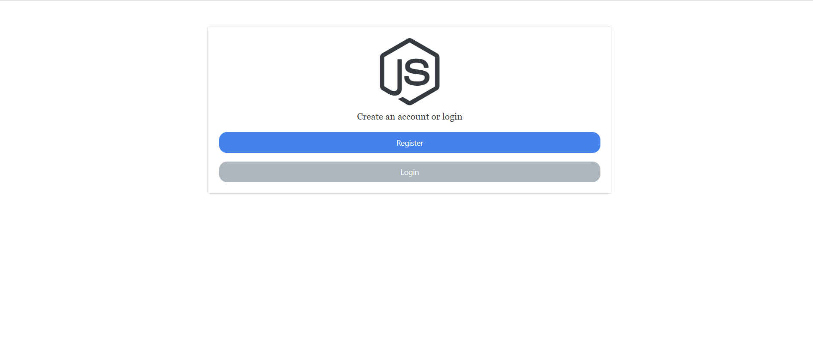
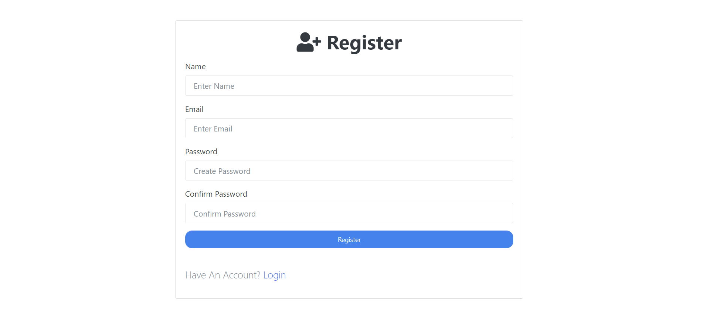
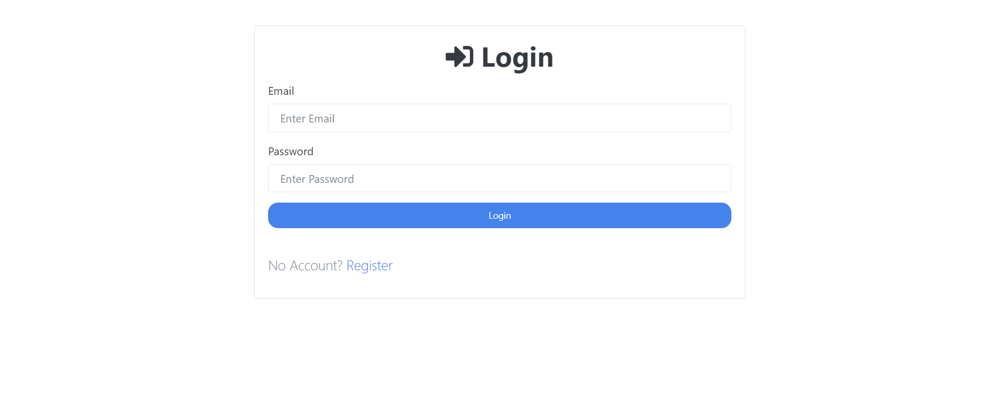
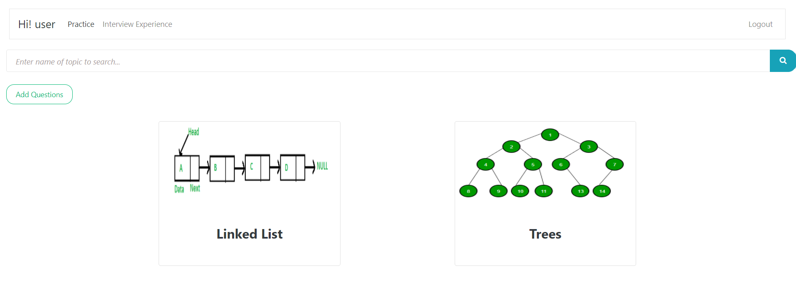
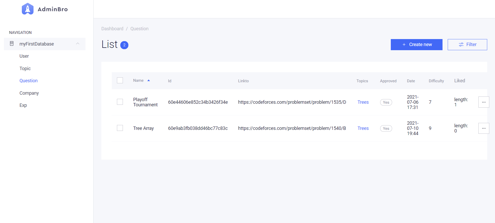
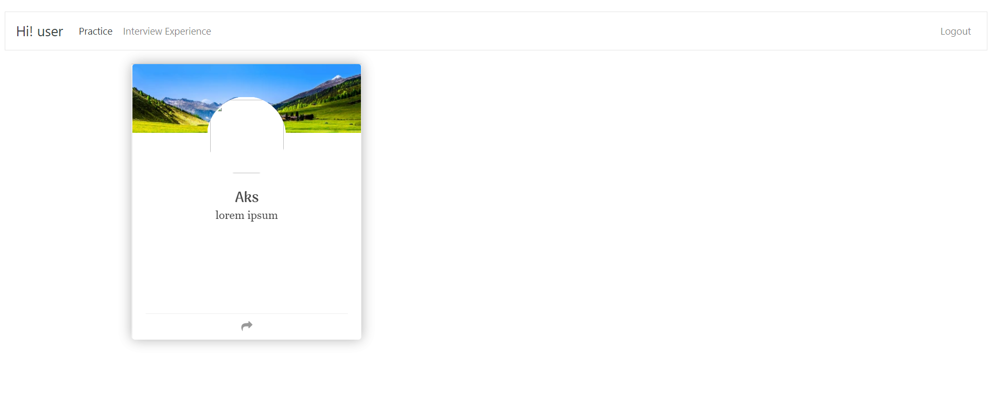
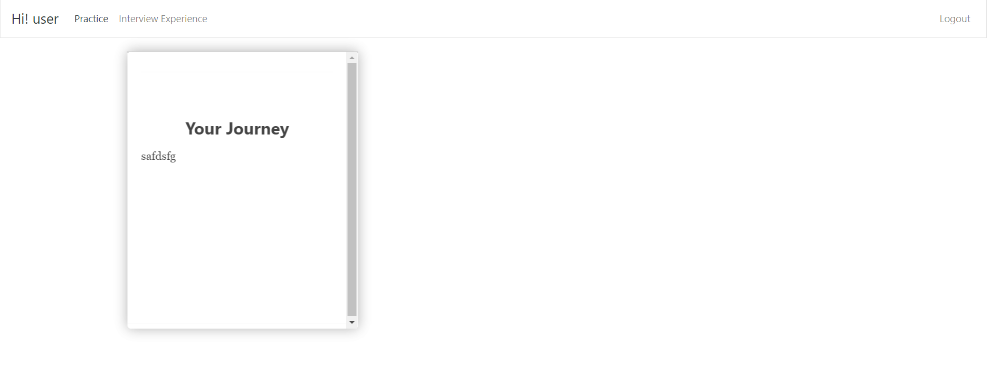

# Interview Tracker

Server side programming was done on nodejs. In this we basically made a web app where one has to register on the server by giving their details, after which they can practice problems under different tags related to CP. They can also read intern experience of various students and can upload their own experience also if they want. <br>

## Dependencies used

- [Mongoose](https://mongoosejs.com/docs/)
- [EJS](https://ejs.co/)
- [Express](http://expressjs.com/)
- [Passport](http://www.passportjs.org/docs/)
- [Admin-bro](https://adminbro.com/section-modules.html)
- [Multer](https://www.npmjs.com/package/multer)

## Usage

In order to run the website locally on your computer , follow the steps given below:

- Clone this github repo.
- Open the terminal and change the directory to the downloaded folder then run the command

```sh
 npm install
```

- The above command will install all the required packages and dependencies required for the project
- The final step is to run the following command

```sh
 npm start
# Or run with Nodemon
 npm run dev

```

`Visit http://localhost:5000`

Before that open "config/keys.js" and add your MongoDB URI :<br>
`module.exports = { MongoURI : 'mongodb+srv://<user>:password@cluster08451.am7f4.mongodb.net/<name of database>?retryWrites=true&w=majority' }`

## Welcome page



## Register Page

_You have to first register on this site to access all the resources._


## Login Page

_This is the login page. Enter your credentials to login._


## User Panel(Programming-Practice)

_You can practice questions related to all the topics mentioned.
You can also contribute by adding questions that you think would be helpful for others._


## Companies

_You can share your experience regarding your interview in one of these companies_


## Admin panel

_We have used admin-bro library for making an iteractive admin panel. Main purpose of the admin is to aprrove the questions and experiences added by the users. He can also control various other site services._


## Interview experience

_This is how your shared experience will look like on website. You can add your experience also._




> This web app was built by me and my team :

- Pranshu Dahiya
- Mesharya M Choudhary
- Ujjwal Ranjan
- Akshat Arun
